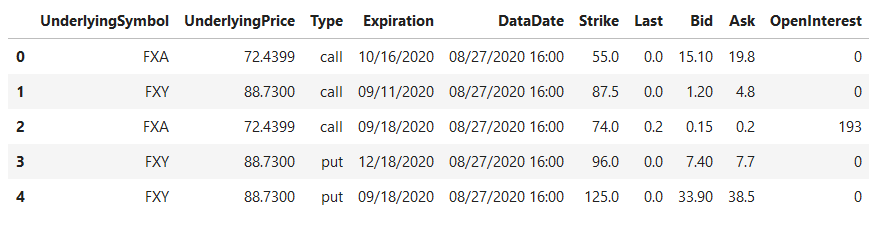
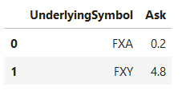
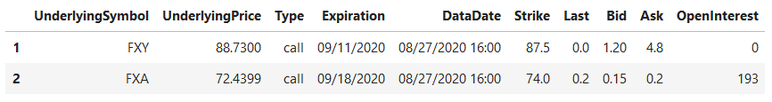

# pandas-groupby-filter
Playbook for pandas groupby filter.

Pandas dataframe uses .groupby() object for reduce calculations.  For example, given a dataframe of financial options data with a column 'UnderlyingSymbol' for ticker symbol and a column 'Ask' for premium ask price.

## Sample Dataframe: 


A simple `.groupby('UnderlyingSymbol')['Ask'].min()` calculation would provide a list of the lowest asking prices per symbol.  

## Sample Groupby: 


But in many cases, we are still interested in seeing the other columns as well.  Similar to a filtering operation in combination with groupby operation.  Use combination of `.groupby()`, `.transform()`, and boolean mask.  

```python
# groupby filter: find minimum 'Ask' per 'UnderlyingSymbol'
mask_gb_filter = df_sample.groupby(['UnderlyingSymbol'])['Ask'].transform(min) == df_sample['Ask']
df_gb_filter = df_sample.loc[mask_gb_filter]
```

## Sample Groupby Filter: 


Alternatively, this method could also filter on specific columns of interest by passing a list of columns to the `.loc[]` operation.  
